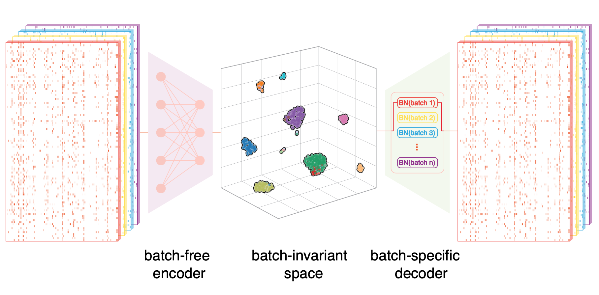

# [Online single-cell data integration through projecting heterogeneous datasets into a common cell-embedding space](https://www.nature.com/articles/s41467-022-33758-z)

## News
#### [2022-10-17] SCALEX is online at [Nature Communications](https://www.nature.com/articles/s41467-022-33758-z)

## [Documentation](https://scalex.readthedocs.io/en/latest/index.html) 
## [Tutorial](https://scalex.readthedocs.io/en/latest/tutorial/index.html) 
## Installation  	
#### install from PyPI

    pip install scalex
    
#### install from GitHub
install the latest develop version

    pip install git+https://github.com/jsxlei/scalex.git

or git clone and install

    git clone git://github.com/jsxlei/scalex.git
    cd scalex
    python setup.py install
    
SCALEX is implemented in [Pytorch](https://pytorch.org/) framework.  
SCALEX can be run on CPU devices, and running SCALEX on GPU devices if available is recommended.   

## Getting started

SCALEX can both used under command line and API function in jupyter notebook   
Please refer to the [Documentation](https://readthedocs.org/projects/scalex/badge/?version=latest) and [Tutorial](https://scalex.readthedocs.io/en/latest/tutorial/index.html)

### 1. API function

    from scalex import SCALEX
    adata = SCALEX(data_list, batch_categories)
    
Function of parameters are similar to command line options.  
Output is a Anndata object for further analysis with scanpy.  
`data_list` can be 
* data_path, file format included txt, csv, h5ad, h5mu/rna, h5mu/atac, dir contains mtx
* list of data_paths
* [Anndata]((https://anndata.readthedocs.io/en/stable/anndata.AnnData.html#anndata.AnnData))
* list of [AnnData]((https://anndata.readthedocs.io/en/stable/anndata.AnnData.html#anndata.AnnData))
* above mixed

`batch_categories` is optional, name of each batch, will be range from 0 to N-1 if not provided

### 2. Command line
#### Standard usage

    SCALEX --data_list data1 data2 dataN --batch_categories batch_name1 batch_name2 batch_nameN 
    
    
`--data_list`: data path of each batch of single-cell dataset, use `-d` for short

`--batch_categories`: name of each batch, batch_categories will range from 0 to N-1 if not specified

    
#### Output
Output will be saved in the output folder including:
* **checkpoint**:  saved model to reproduce results cooperated with option --checkpoint or -c
* **[adata.h5ad](https://anndata.readthedocs.io/en/stable/anndata.AnnData.html#anndata.AnnData)**:  preprocessed data and results including, latent, clustering and imputation
* **umap.png**:  UMAP visualization of latent representations of cells 
* **log.txt**:  log file of training process

### Other Common Usage
#### Use h5ad file storing `anndata` as input, one or multiple separated files

    SCALEX --data_list <filename.h5ad>

#### Specify batch in `anadata.obs` using `--batch_name` if only one concatenated h5ad file provided, batch_name can be e.g. conditions, samples, assays or patients, default is `batch`

    SCALEX --data_list <filename.h5ad> --batch_name <specific_batch_name>
    
    
#### Integrate heterogenous scATAC-seq datasets, add option `--profile` ATAC
        
    SCALEX --data_list <filename.h5ad> --profile ATAC
    
#### Inputation simultaneously along with Integration, add option `--impute`, results are stored at anndata.layers['impute']

    SCALEX --data_list <atac_filename.h5ad> --profile ATAC --impute True
    
    
#### Custom features through `--n_top_features` a filename contains features in one column format read

    SCALEX --data_list <filename.h5ad> --n_top_features features.txt
    
#### Use preprocessed data `--processed`

    SCALEX --data_list <filename.h5ad> --processed

#### Option

* --**data_list**  
        A list of matrices file (each as a `batch`) or a single batch/batch-merged file.
* --**batch_categories**  
        Categories for the batch annotation. By default, use increasing numbers if not given
* --**batch_name**  
        Use this annotation in anndata.obs as batches for training model. Default: 'batch'.
* --**profile**  
        Specify the single-cell profile, RNA or ATAC. Default: RNA.
* --**min_features**  
        Filtered out cells that are detected in less than min_features. Default: 600 for RNA, 100 for ATAC.
* --**min_cells**  
        Filtered out genes that are detected in less than min_cells. Default: 3.
* --**n_top_features**  
        Number of highly-variable genes to keep. Default: 2000 for RNA, 30000 for ATAC.
* --**outdir**  
        Output directory. Default: 'output/'.
* --**projection**  
        Use for new dataset projection. Input the folder containing the pre-trained model. Default: None. 
* --**impute**  
        If True, calculate the imputed gene expression and store it at adata.layers['impute']. Default: False.
* --**chunk_size**  
        Number of samples from the same batch to transform. Default: 20000.
* --**ignore_umap**  
        If True, do not perform UMAP for visualization and leiden for clustering. Default: False.
* --**join**  
        Use intersection ('inner') or union ('outer') of variables of different batches. 
* --**batch_key**  
        Add the batch annotation to obs using this key. By default, batch_key='batch'.
* --**batch_size**  
        Number of samples per batch to load. Default: 64.
* --**lr**  
        Learning rate. Default: 2e-4.
* --**max_iteration**  
        Max iterations for training. Training one batch_size samples is one iteration. Default: 30000.
* --**seed**  
        Random seed for torch and numpy. Default: 124.
* --**gpu**  
        Index of GPU to use if GPU is available. Default: 0.
* --**verbose**  
        Verbosity, True or False. Default: False.
    

	
    
#### Help
Look for more usage of SCALEX

	SCALEX.py --help 
    
    
## Release notes

See the [changelog](https://github.com/jsxlei/SCALEX/CHANGELOG.md).  

## Citation

Xiong, L., Tian, K., Li, Y., Ning, W., Gao, X., & Zhang, Q. C. (2022). Online single-cell data integration through projecting heterogeneous datasets into a common cell-embedding space. Nature Communications, 13(1), 6118. https://doi.org/10.1038/s41467-022-33758-z

    