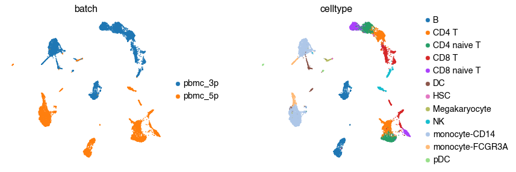
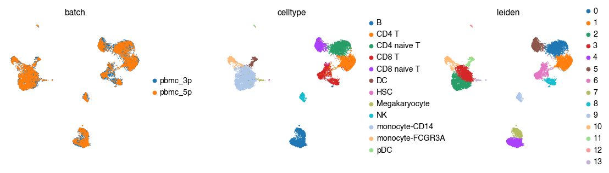
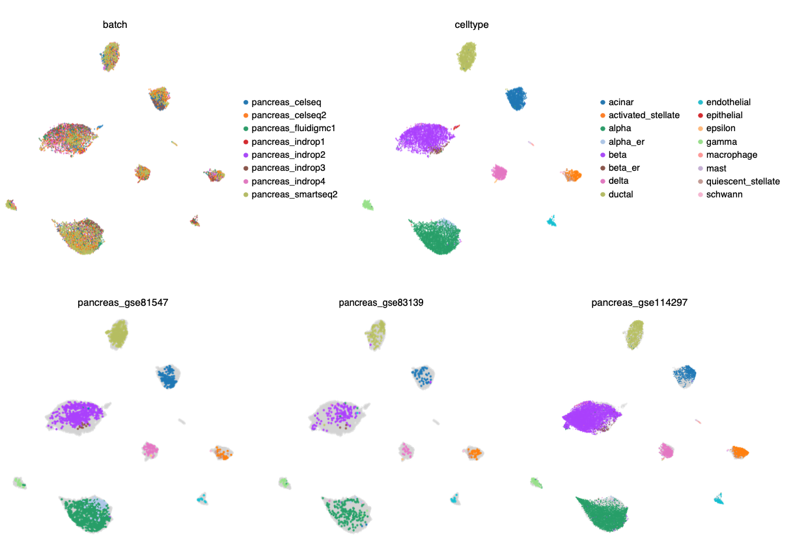
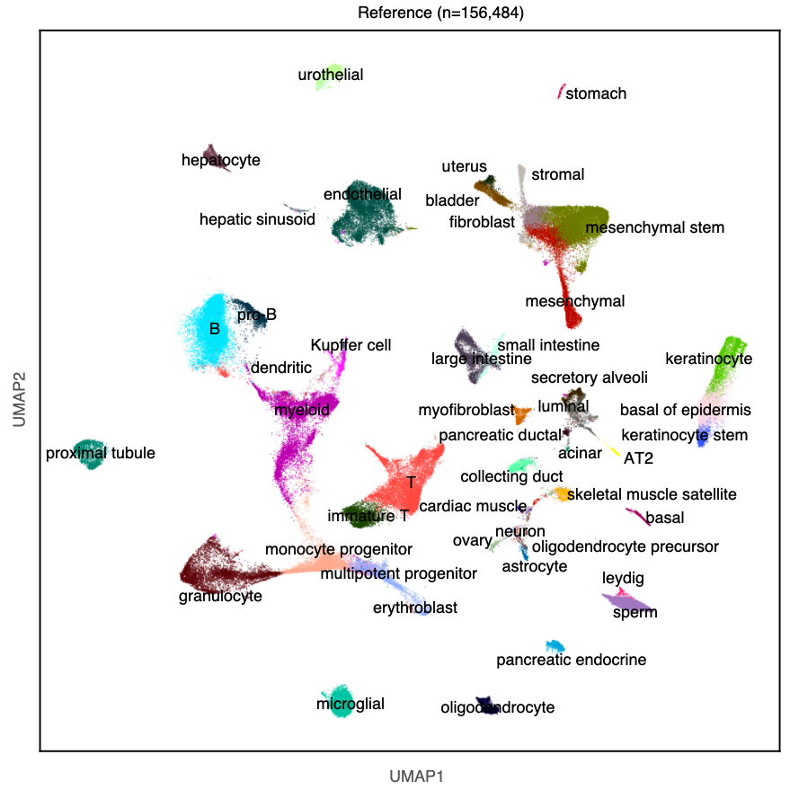
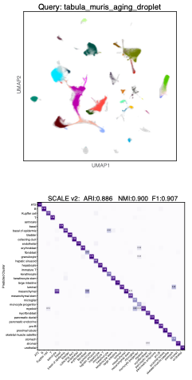
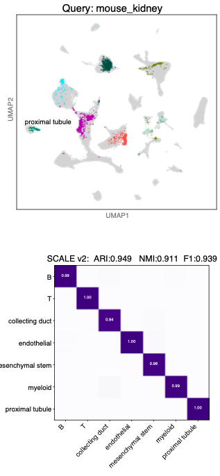
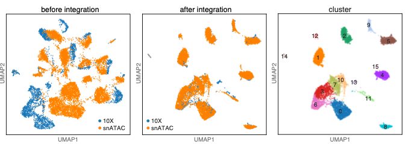
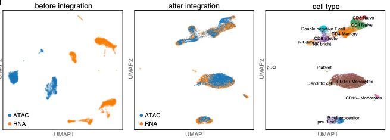

Tutorial
=========

`Integration <../tutorial/Integration_PBMC.ipynb>`_
--------------------

before integration

after SCALE v2 integration

`Projection <../tutorial/Projection_pancreas.ipynb>`_
-------------

Map new data to the embeddings of reference

A pancreas reference was created by integrating eight batches.

Here, map pancreas_gse81547, pancreas_gse83139 and pancreas_gse114297 to the embeddings of pancreas reference.

Label transfer
---------------
Annotate cells in new data through label transfer

Label transfer tabula muris data and mouse kidney data from mouse atlas reference

mouse atlas reference

     
query tabula muris aging and query mouse kidney
    

    
    
`Integration scATAC-seq data <Integration_scATAC-seq.ipynb>`_
---------------

Integration cross-modality data
-------------------------------
Integrate scRNA-seq and scATAC-seq dataset

    

Spatial data (To be updated)
------------
Integrating spatial data with scRNA-seq

Examples
--------

.. toctree::
    :maxdepth: 2
    :hidden:
    
    Integration_PBMC
    Projection_pancreas
    Integration_scATAC-seq
    
    

   

